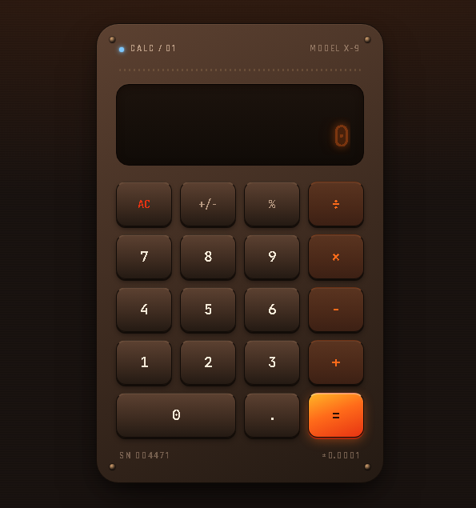

<div align="center">


<br/>

<a href="https://arshiya7-dev.github.io/calculator/" target="_blank">
  
</a>

<br/><br/>


</div>

---

## ✦ Overview

**CALC / 01** is a handcrafted calculator with a **forge-and-fire** aesthetic — built entirely with vanilla HTML, CSS, and JavaScript. Every pixel references the heat of a blacksmith's workshop: glowing amber displays, ember-pulsing buttons, warm bronze rivets, and a deep iron-dark casing.

No frameworks. No dependencies. Just pure craft.

---

## ✦ Preview

<p align="center">
  
</p>

<div align="center">

| Feature | Detail |
|---|---|
| 🎨 Theme | Forge / Blacksmith — warm bronze & flame |
| 🔠 Typography | JetBrains Mono + Space Grotesk + Rajdhani |
| 💡 Display | Flame-orange glow with CRT-style text shadow |
| 🔘 Buttons | Depth-shadowed keys with press animation |
| 🔥 `=` Key | Animated ember-pulse glow (pauses on hover) |
| 💙 Power LED | Gas-flame pilot blue accent |
| 📱 Responsive | Works on mobile & desktop |

</div>

---

## ✦ Features

- ➕ Addition, ➖ Subtraction, ✖️ Multiplication, ➗ Division
- **+/−** Toggle sign on any operand
- **%** Percentage conversion
- **AC** Full clear / reset
- Chained operations (result feeds into next calculation)
- Keyboard input support (digits, decimal, backspace)
- Live expression display with result preview
- Smooth press animation on every key

---

## ✦ Tech Stack

| Layer | Technology |
|---|---|
| Structure | HTML5 |
| Styling | Tailwind CSS (CDN) + Custom CSS Variables |
| Logic | Vanilla JavaScript (ES6) |
| Fonts | Google Fonts — JetBrains Mono, Space Grotesk, Rajdhani |
| Icons | Remix Icon |
| Deploy | GitHub Pages |

---

## ✦ Project Structure

```
calculator/
├── index.html                   # Main HTML + keypad layout
├── asset/
│   ├── javascript/
│   │   └── master.js            # Calculator logic
│   └── stylesheet/
│       ├── main.css             # Tailwind source
│       └── output.css           # Compiled CSS (optional)
└── README.md
```

---

## ✦ Getting Started

Clone and open — no build step required:

```bash
git clone https://github.com/arshiya7-dev/calculator.git
cd calculator
open index.html
```

Or just visit the **[Live Demo →](https://arshiya7-dev.github.io/calculator/)**

---

## ✦ Design Tokens

The entire color system lives in CSS custom properties:

```css
--forge-darkest:  #1a1310   /* page background          */
--flame-orange:   #ff6b1a   /* primary accent / display */
--flame-gold:     #ffb627   /* = key highlight          */
--flame-red:      #e63312   /* clear key / danger       */
--ash:            #f5ead8   /* primary text             */
--pilot-blue:     #7ec8ff   /* power LED                */
--bronze:         #8a6a4a   /* vents & rivets           */
```

---

## ✦ License

MIT — free to use, fork, and forge into something new.

---

<div align="center">

Crafted with 🔥 by **[arshiya7-dev](https://github.com/arshiya7-dev)**

<a href="https://arshiya7-dev.github.io/calculator/">
  
</a>

</div>
